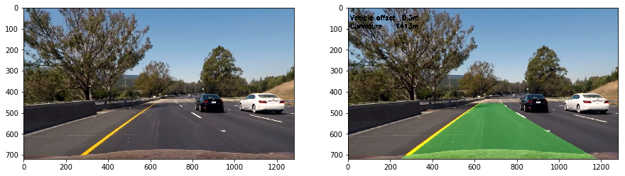

# Advanced Lane Finding

## Project Report

This project consists of using advanced computer vision methods to find
lane lines on road images and road video.

The steps are:

- Remove camera distortion
- Transform image using filters: Sobel gradient, magnitude, HLS channel
- Warp image (perspective transform)
- Find lane pixels
- Polyfit pixel position into a second-order polynomial
- Calculate road curvature and car offset from middle of the road
- Transform polyfit back and ovelay onto the original image

These steps form a pipeline which should be applied also to a video stream.

### Camera calibration

In order to calibrate the algorithm for the camera, input images were 
provided. Calibration is done using chess board images with functions
 `cv2.findChessboardCorners` and `cv2.calibrateCamera`. The result of 
 calibration is the camera matrix `mtx` and distortion coefficients `dist`.
All images are transformed to grayscale during calibration.


Testing calibration: see the change in position for the white car.


### Transforms

Transformations applied to the images were:

- Sobel gradient (gradx, magnitude and direction thresholds)
- RGB to HLS color space convertion
- apply S-channel threshold 

Below example with image `straight_lines2.jpg`, left to right: distorted image,
combined threshold and warp image.


Binary and thresholds are combined using the `&` operator on numpy images inside 
`apply_threshold` function, as:

```python

s_binary = np.zeros_like(s_channel)
s_binary[(s_channel >= s_thresh[0]) & (s_channel <= s_thresh[1])] = 1

combined = np.zeros_like(s_binary)
combined[(gradx == 1) | ((mag_binary == 1) & (dir_binary == 1)) | (s_binary == 1)] = 1

```

The perspective transform is done with `cv2.warpPerspective` inside function
`camera_top_view`.


### Lane line search

To find the lane lines for the first frame (1 image), it is calculated the
histogram for the lower part of the image. This gives the possible position
of the left and right lines.

A for-loop runs 9 stripes searching the image from bottom to the top. The 
search window is limited by 50 pixels on each side.
The algorithm uses `numpy.nonzero` function to find x,y positions where the 
binary image (0, 1) is nonzero. The mean of pixel positions is calculated and
and used to set the next window.

```python

# left line
good_left_inds = ((nonzeroy >= win_y_low) & (nonzeroy < win_y_high) & 
    (nonzerox >= win_xleft_low) & (nonzerox < win_xleft_high)).nonzero()[0]

# right line
good_right_inds = ((nonzeroy >= win_y_low) & (nonzeroy < win_y_high) & 
    (nonzerox >= win_xright_low) & (nonzerox < win_xright_high)).nonzero()[0]

``` 


The algorithm takes these pixel positions and fits a second-order polynomial
with `numpy.polyfit`.

For the video feed, the polynomial is the mean of the last 15 frames.

```python
left_lane_inds.append(good_left_inds)
leftx = np.append(nonzerox[left_lane_inds], leftx_add)
lefty = np.append(nonzeroy[left_lane_inds], lefty_add)
left_fit = np.array([np.polyfit(lefty, leftx, 2)])
```

### Radius of curvature

The radius of curvature of the road is the mean of both lines calculated at
the bottom of the image (y = image_height).
The curvature of the polynomial is calculated in function `calc_curvature`:

Consider the polynomial:

f(y) = Ayˆ2 + By + C

The curvature is:

R(y) = ((1+(2Ay+B)ˆ2)ˆ1.5)/|2A|

```python
def calc_curvature(fit, y):
    if fit is None:
        return 0.0
    return (1 + (2*fit[0]*y + fit[1])**2)**1.5 / np.absolute(2 * fit[0])
```

For a road designed for 120km/h the usual minimum radius of curvature based 
on USA AASHTO is 1000m.

The position of the vehicle from the middle of the road is estimated
considering the lane with 3.7m (12 feet) and that the camera is mounted 
in the center of the vehicle.

```python
lx = np.dot(self.left.best_fit,  [self.shape[0]*self.shape[0], self.shape[0], 1])
rx = np.dot(self.right.best_fit, [self.shape[0]*self.shape[0], self.shape[0], 1])
lanewidth = rx - lx
lanecenter = (lx + rx) / 2
imgcenter = self.shape[1]/2
p = (lanecenter - imgcenter) * 3.7 / lanewidth
```

### Back to perspective

With all transformations done, the polyfit can be warped back over the 
original image.



### Apply the pipeline to video feed

The pipeline presented here was combined in a Python Class to make it easier
to keep data from frame to frame.

Polynomial fit is mean from the las 15 frames.
Search windows are estimated from the previous best fit.

Output video is [here](./project_video_overlay.mp4).
Jupyter notebook is [here](./Notebook.ipynb).

## Discussions

Some of the problems encountered in this project were:

- polyfit can greatly change depending on threshold parameters
- mix use of `list`, `tuple`, `numpy.array` and `array of arrays` sometimes is
confusing
- changes in asphalt tones, shadows and light pose a challenge
- not specifying color map in `imshow` produces purple plots
- `numpy.polyfit` can produce RankWarning for bad arrays
- `cv2.imread` reads images in BGR color order
- points for perspective transform must be chosen wisely
- jupyter interact was great help in parameter selection


